# FINAL REPORT

    * Team Number: 19
    * Team Name: AC-DC
    * Team Members: Aditya Rangamani and Madison Hughes
    * Github Repository URL: https://github.com/ese5160/a14g-final-submission-s25-t19-ac-dc.git
    * Description of test hardware: custom PCB, Windows 11

## 1. Video Presentation

## 2. Project Summary

### Device Description

Our device is a sun tracking solar panel with a built in battery management system. Its intention is to use voltage generated by a solar panel to power a battery and display the current, voltage and temperature of the battery to a custom designed website for our users. The website will display when the voltage of the battery is too low with an indicator LED. It will also show the current temperature of the battery and allow the user to toggle a cooling fan on and off. The device will also automatically toggle the cooling fan on and off depending on the battery temperature. This is a low cost, energy efficient solution for people who are concious about their carbon footprint and curious about the energy used by their devices.

### Device Functionality

The device works by having a solar panel with photodiodes attached. The photodiodes will give information detailing where the maximum light is coming from. There will be a servo motor that will move to change the position of the solar panel to face the direction of the most sunlight. This solar energy will then go into our battery charging IC and through a voltage/current sensor, both placed on our PCB. This will then go into our peripheral battery where it will be charged. As the battery is charging, there will be an indicator LED which shows the user when the voltage is below a certain threshold. The cooling fan and temperature sensor will be attached/placed in close proximity to the battery to allow them to be the most useful and accurate. A simple DC motor will be used after the battery has been charged to display the functionality of the charging circuit.
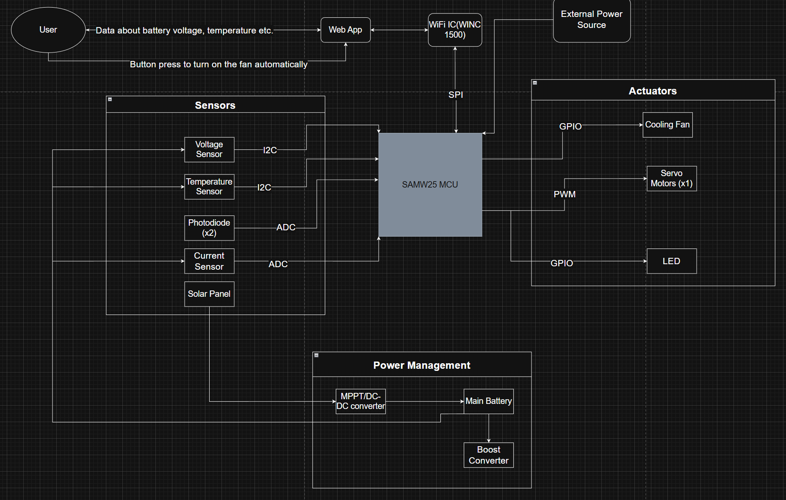

### Challenges

There were many challenges that we faced in the implementation of our device. Our project included many different sensors: a voltage sensor, four photodiodes going into a four-channel ADC MUX, and a temperature sensor. Due to the limited time we had for firmware drivers, and the intricacies of our ICs, it took a lot of time to finish and debug these drivers. Our ADC MUX in particular was very intricate with not much helpful documentation on how any particular configuration should look. It included several different modes including manual, automatic, single read, multiple read, reading from multiple registers at one time etc. The datasheet did not provide a lot of information on what these modes actually did and how a typical implementation would utilize them or configure them. Therefore, we spent many days debugging this which set us back on other drivers. We also had many actuators including a DC motor, a servo, a cooling fan and an LED. Although these actuator drivers were much easier to configure, we were then left with very little time to work on them.

### Prototype Learnings

Overall, our project could have benefitted from streamlining the amount of features but during its conception we were unaware of the true time crunch we would have. We should have stuck to fewer sensors and fewer actuators but were nervous about the project not being complex enough without considering that we could have added more features after the first ones were implemented. We also should have picked ICs based more off of their documentation and the ability to be able to quickly and effectively write drivers for them. This would have allowed us more time to focus on the mechanical aspects of the project instead of debugging the firmware until the last minute. If doing this device again, it would be helpful to just focus on the solar power aspect and not the battery management aspect. This way we could have ensured that this worked like how we wanted to and then maybe at the battery management after since the sensor and the actuator were both off the PCB.

### Next Steps and Takaways

Through this class, we learned the importance of component selection. It is not just choosing a component that could work; it should also be choosing components that are feasible given time constraints and one's own knowledge and ability. When taking this project further, it would help to switch to new sensors with better documentation and to streamline the device further.

### Project Links

#### Node Red URL

http://20.185.54.69:1880/

#### Final PCB on Altium365

https://upenn-eselabs.365.altium.com/designs/53786B09-9B1F-4C56-985B-DD8DCF656A41#design

## 3. Hardware & Software Requirements

### Hardware Requirements

HRS 01 - SAMW25 shall be our main microcontroller for all processing. The SAMD21 will be our microcontroller and the WINC1500 WiFi chip will facilitate all of our WiFi connections.
 
&nbsp; *We hit this requirement by using the SAMD21 and the WINC1500 Wifi chip on our PCB.*

HRS 02 - MCP9808-E/MS or equivalent temperature sensor shall be used to keep track of temperature of the battery pack via I2C with an accuracy of +/- 0.5C
 
&nbsp; *We hit this requirement by using the BMP388 temperature sensor and taking measurements through I2C. We measured a temperature of 25C and the thermal gun measured 24.5C.*
 
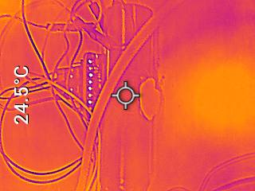
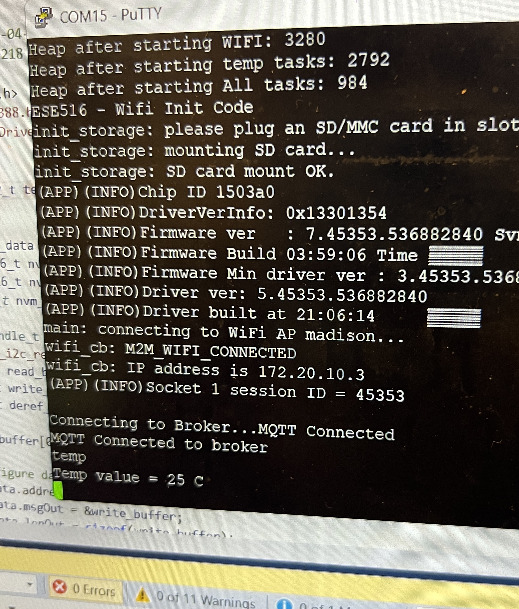

HRS 03 - INA219 or equivalent voltage sensor shall be used to measure the voltage of the battery pack via I2C with an accuracy of +/- 0.1V

HRS 04 - INAx180 or equivalent current sensor shall be used to measure the current of our battery pack with an accuracy of +/- 0.1A

HRS 05 - Adafruit 2941 servo motor or equivalent shall be used to rotate the solar panel fixed onto the gimbal. It shall move 180 degrees laterally and longitudinally.
 
&nbsp; *We did not hit this requirement. When testing our servo motor being powered through an external power supply the output voltage the servo would be attached to is 6V. However, when we power it with the external battery, we are only getting 1.5V which is not enough to power the servo.*
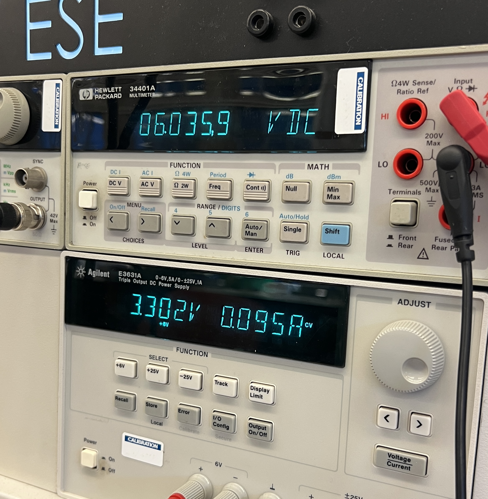
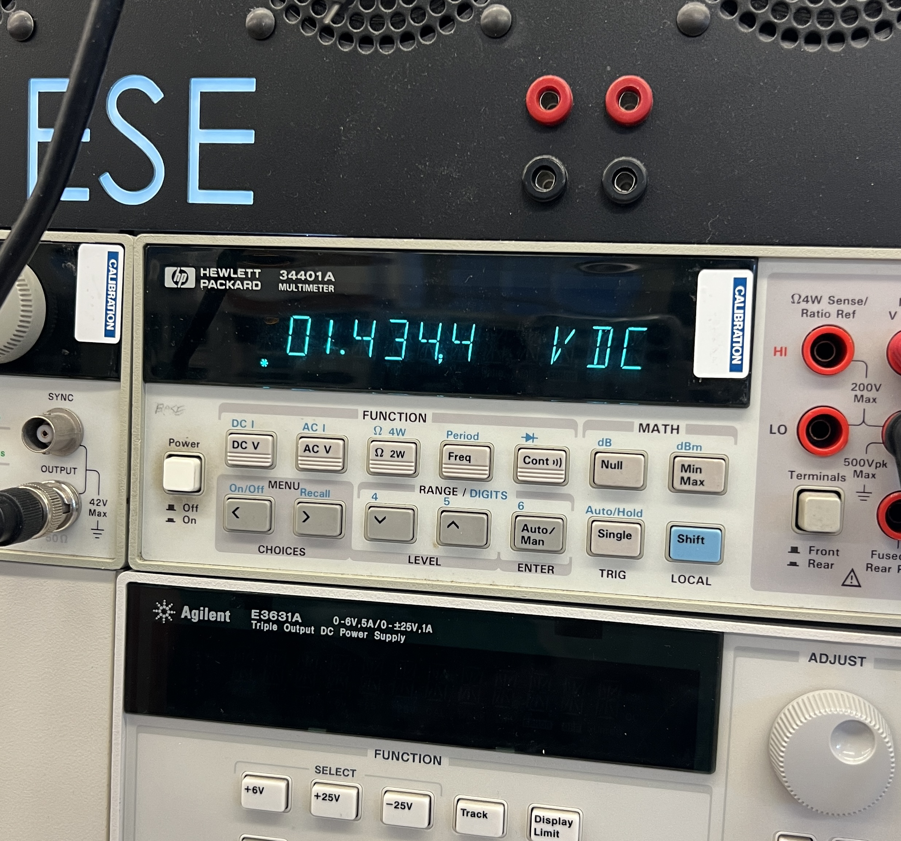

HRS 06 - L298N motor driver or equivalent shall be used for driving the servo motor.
 
&nbsp; *We hit this requirement as we were using an onboard servo motor driver. When we connected the servo directly to power, we were able to drive it through this servo motor driver.*

HRS 07 - Miniature 5V Cooling Fan with Molex PicoBlade Connector for cooling of the battery pack when it overheats. It shall lower the temperature of the battery by at least 10 degrees.

HRS 08 - DC-DC converter/Maximum power point tracker converter to be designed on PCB for solar energy conversion to be stored in our battery pack.
 
&nbsp; *We hit this requirement by using the BQ24120 IC from Texas Instruments on our PCB for the conversion from solar power to voltage for our battery.*

HRS 09 - Kitronik SOLAR PANEL Model NO: PG-120X62-001 or equivalent solar panel shall be used to charge the battery pack.
 
&nbsp; *We hit this requirement by using the Voltaic solar panel (MPN: PRT-18726) to charge our battery through the battery charging IC.*

HRS 10 - Four photodiodes shall be used to detect the intensity of the light being shined on the solar panel. The angles for the dual axis rotation will be calculated using the irradiance on each of the four photodiodes, two for each axis.
 
&nbsp; *We did not hit this requirement as we decided to use 2 photodiodes placed on the right and lefthand side of the solar panel instead due to time constraints.*

HRS 11 - An LED shall be used to display if the battery voltage is below 2V.
 
&nbsp; *We partially hit this requirement as the onboard LEDs turn on when connected through an external power supply but not when connected through the supply battery. The dashboard LED on our Node Red interface did turn on when the voltage reading from the sensor is low. We picked a new threshold of 600mV now since our voltage sensor rarely read above 700mV.*

HRS 12 - A 3.7V Li-Ion battery shall be the main battery that will be monitored. It will be used to power the DC motor via a motor driver.
` `
&nbsp; *We partially hit this requirement by using the Adafruit Li-Ion battery (MPN: 1781) as our peripheral battery. However, we were not able to use this battery to power the DC motor, as it was intended for demonstration, due to time constraints.*

HRS 13 - A 3.7V Li-Ion battery shall be used to power the SAMW25 microcontroller and all sensors.
 
&nbsp; *We did not hit this requirement as our battery is only able to power some of the compoenents by itself. For example, it is able to power the cooling fan but not the servo or the LEDs.*
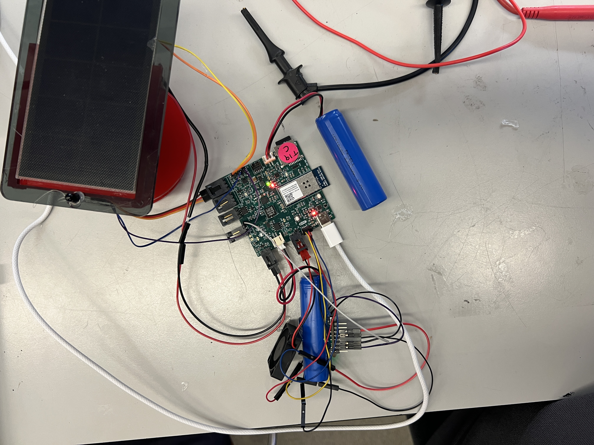
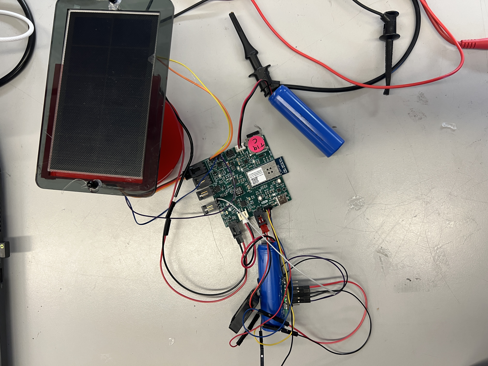

### Software Requirements

SRS 01 - BMP or equivalent temperature sensor shall send data over I2C to the microcontroller once per 0.5 seconds +/- 100 milliseconds.

&nbsp; *We partially hit this requirement by using the BMP388 temperature and pressure sensor to send the temperature values over I2C. We would get very fast values when using the CLI commands, however we were not able to implement it to automatically take readings otherwise due to time constraints.*

SRS 02 - The temperature data shall actuate a fan if the temperature is above 20C.

&nbsp; *We hit this requirement by using a simple FreeRTOS task and semaphore to toggle the fan on/off through a mosfet snice the fan requires more than 40mA current.*

SRS 03 - INA219 or equivalent voltage sensor shall send data over I2C to the microcontroller once per 0.5 seconds +/- 100 milliseconds.

 *We hit this requirement by using the INA219 voltage sensor to send the bus voltage values to the MCU values over I2C.*

SRS 04 - The voltage sensor shall actuate an LED if it is below 2V (after the initial charging phase).

 *We did not hit this requirement since we were not able to measure the charge within the battery, only the voltage that goes through that line to power the battery.*

SRS 06 - All sensor data shall be sent to the user interface from the SAMW25 microcontroller using WiFi, updating once per 0.5 seconds +/- 100 milliseconds.

&nbsp; *We partially hit this requirement by using NODERED and MQTT to send data over WiFi and display to a UI via NODERED. We did face hiccups for the voltage sensor values being displayed but we were able to toggle the fan via NODERED*

SRS 07 - The light intensity from the photodiodes shall be sent and interpreted by the SAMW25 microcontroller updating every 100 milliseconds +/- 10 milliseconds.

&nbsp; *We partially hit this requirement. We had trouble configuring the 4C ADC IC that we had configured onboard. We were able to read from the desired register. However, we were getting values that did not entirely make sense. When the input and output pins were shorted together, effectively making a wire and showing that the "light" is high, we were able to get the maxiumum value (3300mV). Additionally, when we unplugged the pins, effectively making an open circuit and showing that the "light" is low, we were able to get a maximum low value of around 20mV. However, when connecting this to an actual photoresistor, the values did not change depending on the amount of light that was shined on it.*

SRS 08 - The light intensity data shall be used in a feedback loop to correct the position of the solar panel toward a higher intensity of light every 100 milliseconds coinciding with the collection of new data.

&nbsp; *We hit this requirement by using our motor driver and then manipulating the PWM of the servo through the HAL.*

SRS 09 - L298N motor driver shall be used for driving the servo motor with varying speed and direction through PWM manipulation.

&nbsp; *We hit this requirement by using our motor driver and then manipulating the PWM of the servo through the HAL.*

## 4. Project Photos & Screenshots

### FINAL PROJECT

|                                                |                                                |                                                 |
| ---------------------------------------------- | ---------------------------------------------- | ----------------------------------------------- |
| 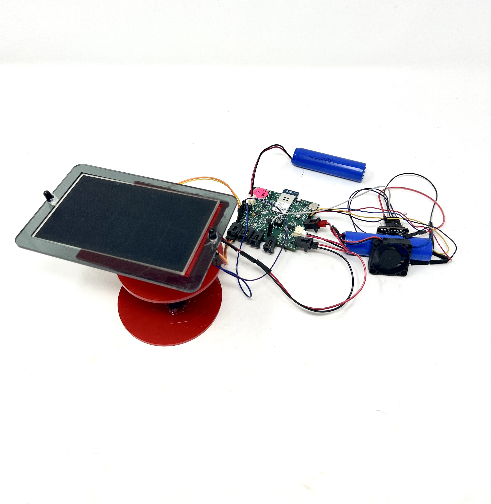            | 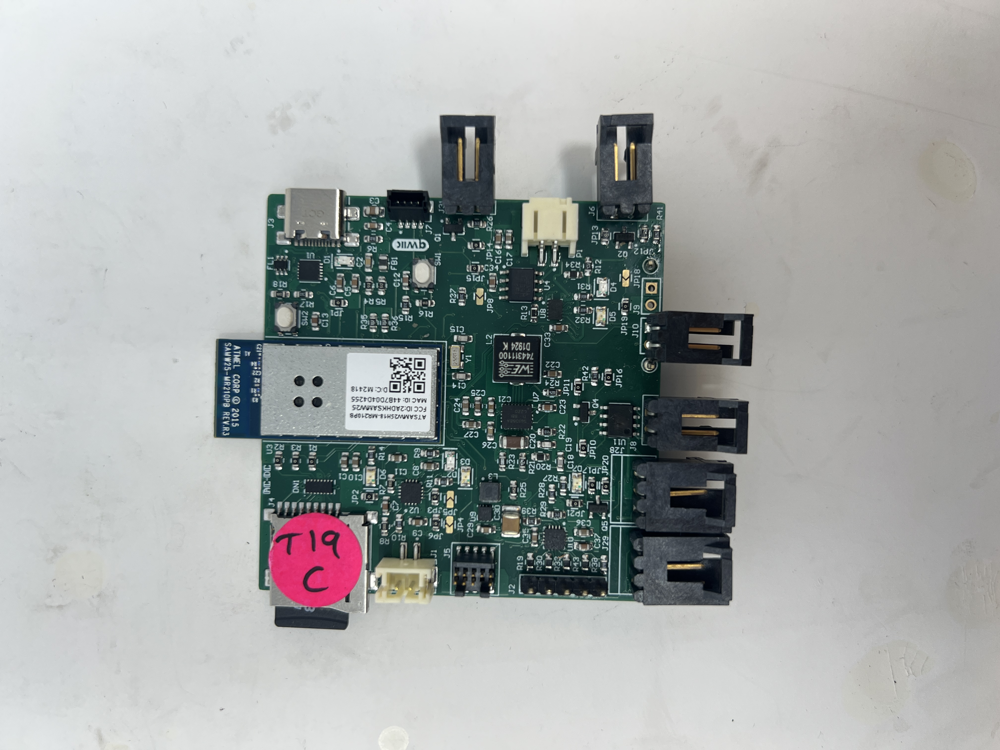                  | 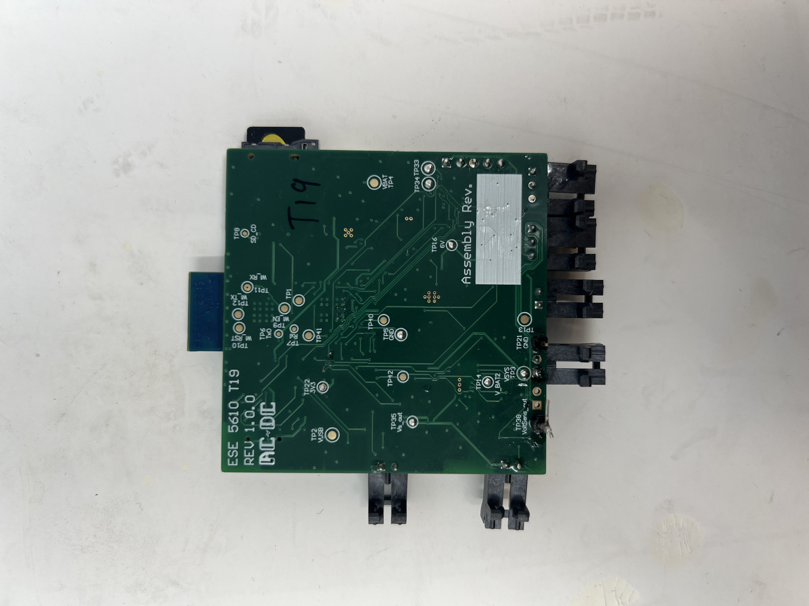                |
| 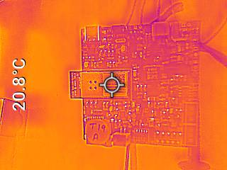   | 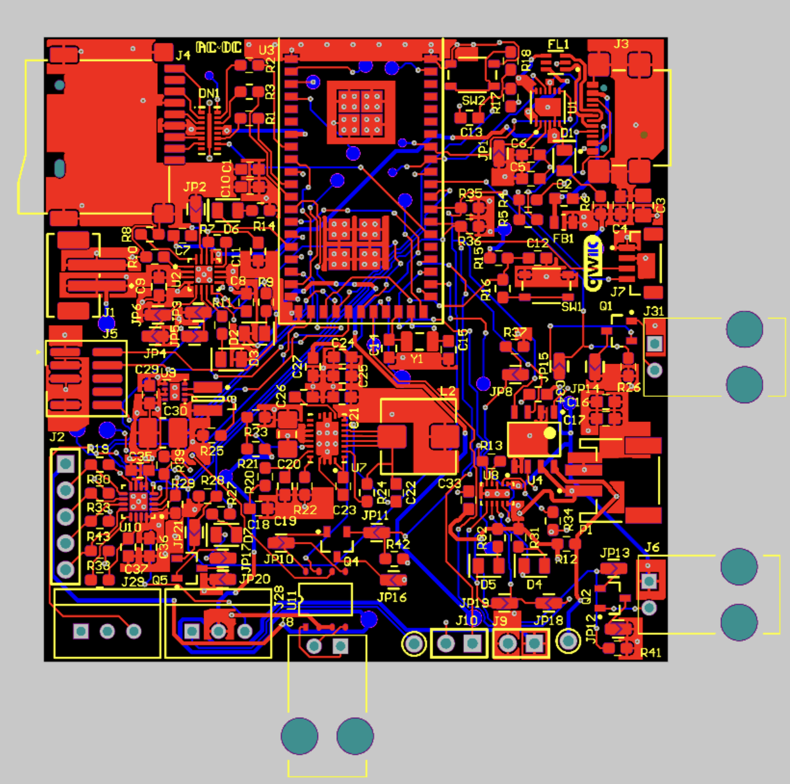    | 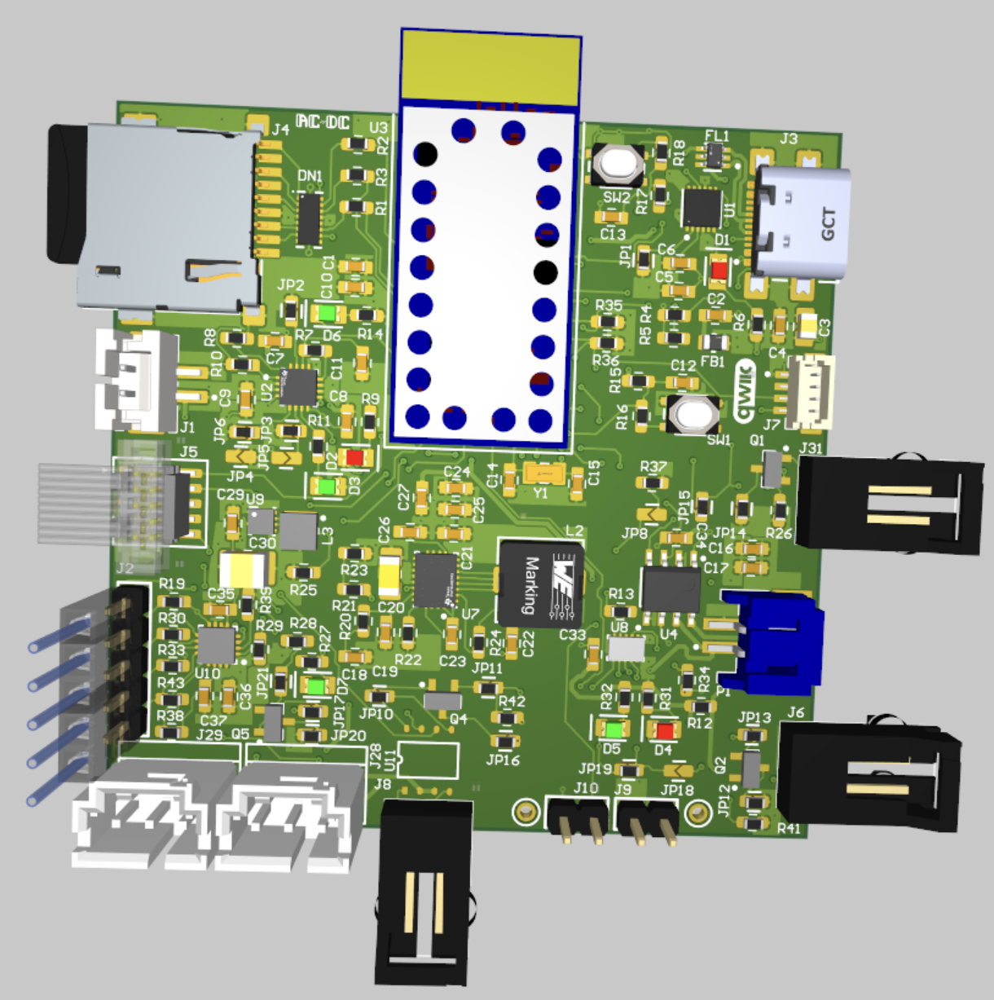   |
| 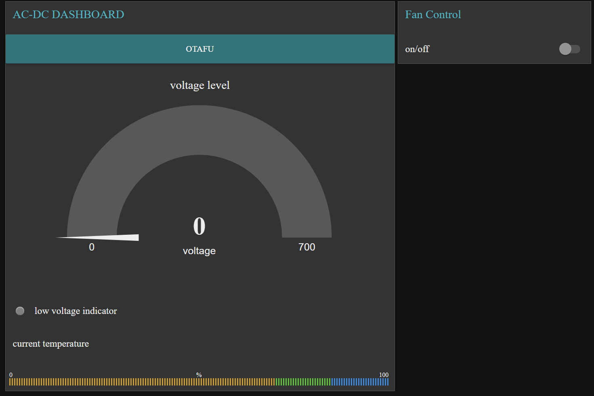 | 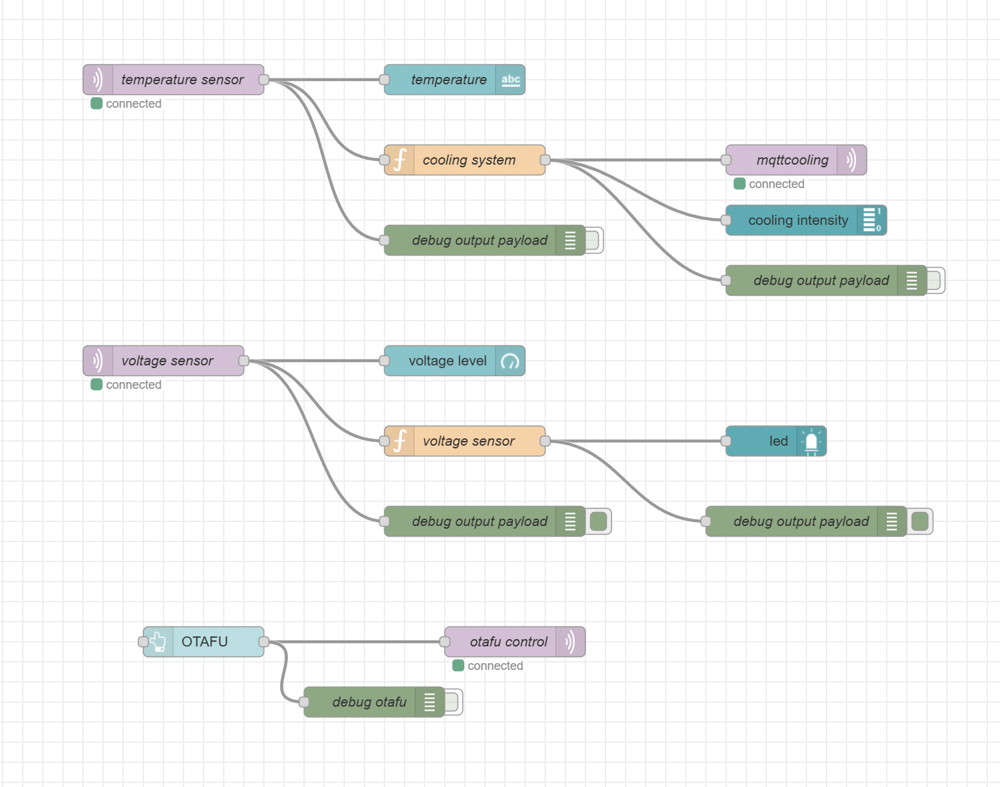 |  |

## Codebase

- A link to your final embedded C firmware codebases
  https://github.com/ese5160/final-project-t19-ac-dc.git
- A link to your Node-RED dashboard code
  http://20.185.54.69:1880/#flow/cebf7bed2b101f7e
